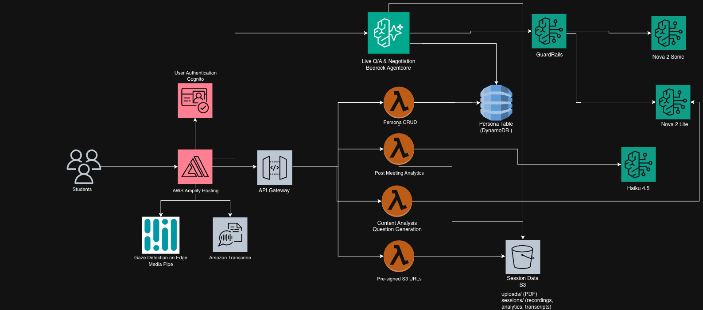

# W. P. Carey Real Estate Program — AI Presentation Coach

An AI-powered experiential learning platform for the W. P. Carey School of Business at Arizona State University. Students practice real estate development presentations in front of AI-driven stakeholder personas — commercial lenders, public officials, real estate agents, and negotiation counterparties — and receive real-time delivery feedback, live transcription, post-session AI analytics, and interactive voice Q&A.

**🌐 Live App:** [https://main.d2v1f9m26bi3az.amplifyapp.com](https://main.d2v1f9m26bi3az.amplifyapp.com)

---

## Disclaimers

Customers are responsible for making their own independent assessment of the information in this document. This document:

(a) is for informational purposes only,

(b) references AWS product offerings and practices, which are subject to change without notice,

(c) does not create any commitments or assurances from AWS and its affiliates, suppliers or licensors. AWS products or services are provided "as is" without warranties, representations, or conditions of any kind, whether express or implied. The responsibilities and liabilities of AWS to its customers are controlled by AWS agreements, and this document is not part of, nor does it modify, any agreement between AWS and its customers, and

(d) is not to be considered a recommendation or viewpoint of AWS.

Additionally, you are solely responsible for testing, security and optimizing all code and assets on GitHub repo, and all such code and assets should be considered:

(a) as-is and without warranties or representations of any kind,

(b) not suitable for production environments, or on production or other critical data, and

(c) to include shortcuts in order to support rapid prototyping such as, but not limited to, relaxed authentication and authorization and a lack of strict adherence to security best practices.

All work produced is open source. More information can be found in the GitHub repo.

---

## Table of Contents

| Index | Description |
| :---- | :---------- |
| [High Level Architecture](#high-level-architecture) | System overview and component interactions |
| [Deployment Guide](#deployment-guide) | How to deploy the project |
| [User Guide](#user-guide) | End-user walkthrough |
| [API Documentation](#api-documentation) | REST and WebSocket API reference |
| [Directories](#directories) | Project structure |
| [Modification Guide](#modification-guide) | Guide for developers extending the project |
| [Troubleshooting](#troubleshooting) | Common issues and solutions |
| [Credits](#credits) | Contributors |
| [License](#license) | License information |

---

## High Level Architecture

Students access the platform via a Next.js frontend hosted on AWS Amplify and authenticate through Amazon Cognito. During a practice session the browser captures video and audio locally — MediaPipe runs gaze detection client-side while Amazon Transcribe Streaming (over a signed WebSocket) handles real-time speech-to-text. Session recordings, transcripts, and per-second metric snapshots are uploaded to S3 via pre-signed URLs generated by API Gateway + Lambda.

After recording ends, a Post-Meeting Analytics Lambda invokes Amazon Bedrock (Nova Lite) to produce role-specific written feedback stored back in S3. Personas and their configurations are persisted in DynamoDB.

For the optional live Q&A phase, the browser connects via WebSocket to a Bedrock AgentCore runtime running Nova 2 Sonic for bidirectional voice. Anam AI avatars provide a visual face for each persona. All AI interactions pass through Bedrock Guardrails for content safety and PII protection.



For a detailed explanation, see the [Architecture Deep Dive](./docs/architectureDeepDive.md).

---

## Deployment Guide

For complete deployment instructions, see the [Deployment Guide](./docs/deploymentGuide.md).

### Prerequisites (complete before deploying)

1. **Bedrock models** — Amazon Nova models auto-enable on first invocation. For **Anthropic Claude** models, first-time users may need to submit use case details in the [Bedrock Model Catalog](https://us-east-1.console.aws.amazon.com/bedrock/home#/model-catalog) before access is granted.

2. **Enable Bedrock AgentCore** — navigate to Amazon Bedrock → AgentCore in the AWS Console and complete the one-time activation.

3. **Anam AI API key** (optional) — sign up at [app.anam.ai](https://app.anam.ai) → Account Settings → API Keys. Press Enter during deploy to skip — voice Q&A still works without avatars.

### Quick Start (CloudShell — no local tooling needed)

```bash
git clone https://github.com/ASUCICREPO/Real-Estate-Program.git
cd Real-Estate-Program
bash deploy.sh
```
Follow the prompts (repo, branch, Anam API key, optional GitHub token). CodeBuild handles the rest — ~15 minutes.

---

## User Guide

For detailed usage instructions, see the [User Guide](./docs/userGuide.md).

**Session Flow:**
1. Sign in with your Cognito account
2. Select a persona (Commercial Lender, Public Official, Real Estate Agent, or Negotiation Counterparty)
3. Optionally upload a PDF presentation and add custom persona notes
4. Complete the camera/mic calibration, then start recording
5. View real-time delivery metrics (speaking pace, volume, eye contact, filler words, pauses, monotone level) alongside your slides
6. After recording, review the AI-generated written analysis
7. Start the optional live voice Q&A session with the persona avatar

---

## API Documentation

For complete API reference, see the [API Documentation](./docs/APIDoc.md).

**REST endpoints (API Gateway + Cognito auth):**

| Method | Path | Description |
|--------|------|-------------|
| GET/POST | `/s3_urls` | Generate pre-signed S3 URLs for uploads |
| GET | `/personas` | List all personas |
| POST | `/personas` | Create a persona |
| GET/PUT/DELETE | `/personas/{personaID}` | Manage a single persona |
| GET | `/analytics` | Retrieve post-session AI feedback |
| POST | `/content` | Trigger content analysis / question generation |
| POST | `/anam-session` | Get Anam AI avatar session token |

**WebSocket:** Bedrock AgentCore endpoint for live voice Q&A (bidirectional audio streaming via Nova 2 Sonic).

---

## Directories

```
├── backend/
│   ├── bin/
│   │   └── backend.ts               # CDK app entry point
│   ├── lib/
│   │   └── backend-stack.ts         # Main CDK stack (Cognito, S3, DynamoDB, API GW, Lambdas, Guardrails)
│   ├── lambda/
│   │   ├── s3-presigned-url-gen/    # Pre-signed URL generator
│   │   ├── persona-crud/            # Persona CRUD operations
│   │   ├── post-meeting-analytics/  # AI feedback generation (Bedrock Nova Lite)
│   │   ├── content-analysis/        # PDF content analysis & question generation
│   │   ├── anam-session-token/      # Anam AI avatar session token exchange
│   │   └── layers/boto3-latest/     # Shared boto3 Lambda layer
│   └── agentcore/
│       ├── index.py                 # Bedrock AgentCore voice agent (Nova 2 Sonic)
│       └── qa_system_prompt.jinja2  # Persona Q&A system prompt template
├── frontend/
│   ├── app/
│   │   ├── components/              # React UI components
│   │   │   └── practice/            # Practice session sub-components
│   │   ├── hooks/                   # Custom hooks (audio, video, gaze, analytics)
│   │   ├── services/                # API and WebSocket service layer
│   │   └── config/config.ts         # Centralized app configuration
│   └── public/                      # Static assets
└── docs/
    ├── architectureDeepDive.md
    ├── deploymentGuide.md
    ├── userGuide.md
    └── APIDoc.md
```

---

## Troubleshooting

**Frontend can't reach the API**
- Verify `NEXT_PUBLIC_API_BASE_URL` in `frontend/.env.local` matches the CDK `ApiUrl` output
- Check CORS — Amplify domain must be in the `ALLOWED_ORIGINS` env var on each Lambda

**Camera is black during recording**
- Browser permissions: ensure the site has camera and microphone access
- HTTPS is required for `getUserMedia` — the Amplify domain uses HTTPS by default

**Anam avatar fails with 401**
- The `ANAM_API_KEY` Lambda environment variable is empty or incorrect
- Update it: `aws lambda update-function-configuration --function-name <name> --environment '{"Variables":{"ANAM_API_KEY":"<key>","ALLOWED_ORIGINS":"<origins>"}}'`

**Voice Q&A WebSocket won't connect**
- Verify `NEXT_PUBLIC_WEBSOCKET_API_URL` points to the AgentCore runtime endpoint
- Confirm the AgentCore stack is deployed and the container is healthy

**CDK deploy fails**
- Run `cdk bootstrap aws://<account>/<region>` if deploying to a fresh account/region
- Ensure `ANAM_API_KEY` is set in your shell before running `cdk deploy`

**Amplify shows 404**
- The zip must be built from inside the `out/` directory so `index.html` is at the root
- Run `cd frontend/out && zip -r ../deploy.zip .` then upload via `aws amplify create-deployment`

---

## Credits

This application was developed by :
- <a href="https://www.linkedin.com/in/sreeram-s-5454961aa/" target="_blank">Sreeram Saravana Prasad</a>

---

## License

This project is licensed under the MIT License — see the [LICENSE](./LICENSE) file for details.
